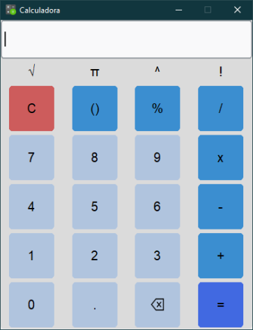

# Calculadora em Python

Este é um projeto de calculadora desenvolvido em Python com uma interface gráfica simples. A calculadora suporta operações matemáticas básicas, parênteses, porcentagens, raiz quadrada, fatorial e potência.



## Funcionalidades

- Realize operações matemáticas básicas (adição, subtração, multiplicação, divisão).
- Utilize parênteses para agrupar expressões, por exemplo: `(2+3)*4`.
- Calcule porcentagens, por exemplo: `10%200`.
- Calcule raiz quadrada, por exemplo: `√16`.
- Calcule potência, por exemplo: `2^3` ou `4**2`.
- Calcule o fatorial de um número, por exemplo: `5!`.
- Interface gráfica amigável.

## Requisitos

Para executar a calculadora, você precisará do seguinte:

- Python 3.x instalado no seu sistema.
- Bibliotecas Python: `PIL` e `customtkinter`.

Para instalar as bibliotecas, execute o seguinte comando:

```bash
pip install -r requirements.txt
```

## Instruções de Uso:
1. Clone o repositório.
2. Execute o arquivo 'main.py' para iniciar a calculadora.

## Licença

Este projeto está sob a licença MIT. Veja o arquivo [LICENSE](LICENSE) para obter mais detalhes.

## Contribuições

Este projeto é de código aberto e aceita contribuições. Sinta-se à vontade para colaborar e melhorar a calculadora. Se você deseja contribuir, siga estas etapas:

1. Fork este repositório.
2. Crie sua própria branch: `git checkout -b feature/sua-contribuicao`
3. Faça suas alterações e commit: `git commit -m 'Adicione sua contribuição'`
4. Envie suas alterações: `git push origin feature/sua-contribuicao`
5. Abra uma solicitação pull.

Aguardo suas contribuições!
